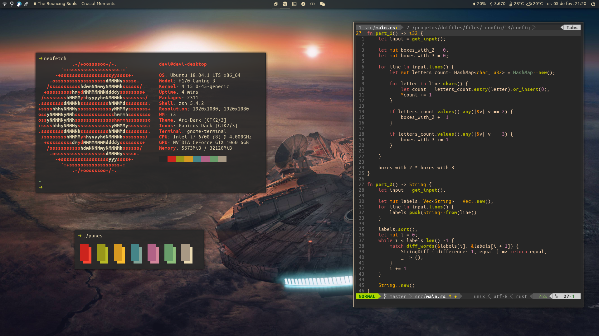

## Introduction

These are my dotfiles. Right now they are a work in progress and they will probably always be. I cannot guarantee that they will work in your machine, so I do not recommend you try to install them. You are welcome, however, to have a look at the files and copy anything that you might find useful.

Here is how it looks like at the moment:



Wallpaper from [https://www.reddit.com/r/wallpapers/comments/7kdoyw/the_falcon/](https://www.reddit.com/r/wallpapers/comments/7kdoyw/the_falcon/)

## Installation

First, clone the repo and make sure of starting all the submodules

```
$ git clone --recurse-submodules https://github.com/davialexandre/dotfiles.git
```

Next, inside the dotfiles folder, use `dotbot` to finish the setup

```
$ ./dotbot/bin/dotbot -d . -c install.conf.yaml
```

### Post-installation setup

The openweathermap module used in the Polybar requires an OpenWeatherMap API key. It searches for that key in the `openweathermap_appid` file, in your home folder. An API key can be obtained at [https://openweathermap.org/appid](https://openweathermap.org/appid)
